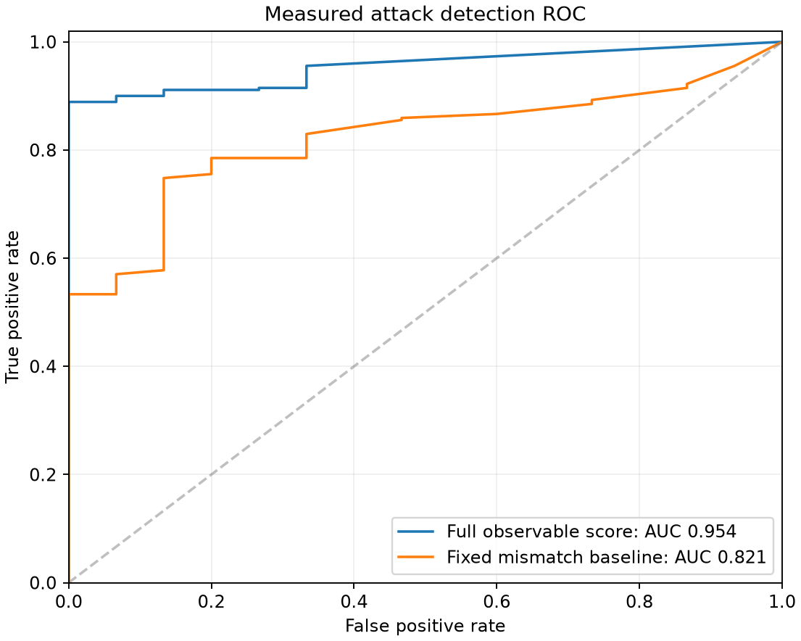
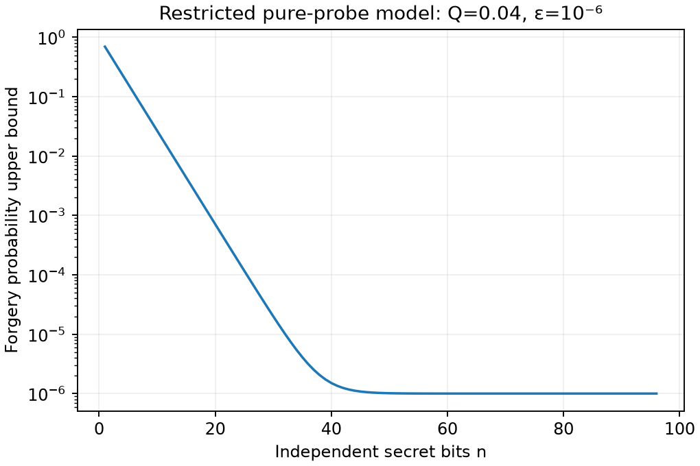
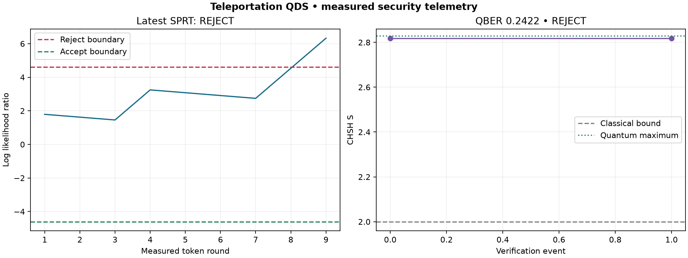

# Measured verification report

Evaluation: 285 runs. No ML, synthetic decisions, or label access in detection.

**Full specification sign-off: NOT ACHIEVED. C3 is unsupported beyond the restricted model; D1/D2 therefore fail.**

| Check | Result | Measured evidence |
|---|---|---|
| A1 | PASS | {"accepts": 50, "runs": 50, "qber_min": 0.0, "qber_max": 0.015625, "qber_std": 0.0031832941768561466} |
| A2 | PASS | {"mean_s": 2.775161569671502, "std_s": 0.030704707012915354} |
| A3 | PASS | {"hits": []} |
| A4 | PASS | {"hits": []} |
| A5 | PASS | {"main_fpr": 0.0, "stress_fixed_qber_threshold": 0.0081787109375, "stress_fpr": 0.3, "note": "Zero observed false positives is valid; an intentionally sensitive fixed threshold demonstrates stochastic false alarms."} |
| B1 | PASS | {"n": [8, 16, 32, 64], "bounds": [0.055039949867562984, 0.0030302860025241112, 1.017657368508851e-05, 1.0000842095045978e-06], "plot": "min_entropy.png"} |
| B2 | PASS | {"statevector_real": [0.7071067811865475, 0.0, 0.0, 0.7071067811865475], "max_imaginary": 0.0, "coherences": [0.5, 0.49653926661579834, 0.4930797069736468]} |
| B3 | PASS | {"exposure": [0, 0.5, 1], "fidelities": [0.999999999999999, 0.9748881610425785, 0.9427744996625028]} |
| B4 | PASS | {"qber": 0.2506103515625, "n": 8192} |
| B5 | PASS | {"strong_mean_rounds": 11.75, "weak_mean_rounds": 66.95, "strong_rejects": 20, "runs": 20, "fixed": {"n": 73, "cutoff": 6, "fpr_under_h0": 0.005483753685403119, "fnr_under_h1": 0.008850836796742843}, "note": "Comparison covers iid token mismatch hypotheses, excluding CHSH overhead and correlated attacks."} |
| B6 | PASS | {"observations": [{"severity": 0, "s": 2.797545548354762}, {"severity": 0.25, "s": 2.385646927392504}, {"severity": 0.5, "s": 2.053022369472955}, {"severity": 0.75, "s": 1.7182853302391323}, {"severity": 1, "s": 1.3634327182796402}], "note": "Honest optimal settings give S=√2 after full Z dephasing, below the classical bound 2."} |
| B7 | PASS | {"confusion_matrix": {"forgery": {"forgery": 20}, "impersonation": {"impersonation": 20}, "replay": {"replay": 20}, "channel_manipulation": {"channel_manipulation": 20}}, "runs_per_class": 20} |
| C3 | FAIL / UNSUPPORTED | {"restricted_experiment_pass": true, "reason": "The requested universal guarantee across coherent/classical attacks is not established. Nontrivial bound assumes independent pure probes; finite proportions are not guaranteed never to exceed probability bounds."} |
| B8 | PASS | {"http_status": 200, "decision": "REJECT", "qber": 0.2421875, "attribution": "forgery", "log_events": 2, "replay_attribution": "replay", "log": "events.jsonl", "payload": "signature_payload.json"} |
| C1 | PASS | {"auc": 0.9535802469135803, "plot": "roc.png", "runs": 285} |
| C2 | PASS | {"sprt_mean_rounds": 48.810526315789474, "baseline_mean_rounds": 104.0, "baseline_auc": 0.8211111111111111, "full_tpr": 0.8296296296296296, "baseline_tpr": 0.5740740740740741, "full_fpr": 0.0, "baseline_fpr": 0.0, "note": "Different operating sensitivities are reported, not described as matched; SPRT uses a separately matched simple-hypothesis design in B5."} |
| C4 | PASS | {"command": ".venv/bin/python run.py", "tests": {"exit_code": 0, "output": "tests.txt"}, "pipeline_completed": true} |
| C5 | PASS | {"path": "LIMITATIONS.md"} |
| D1 | FAIL / UNSUPPORTED | {"reason": "Evidence is attached; full sign-off requires every A/B/C requirement to pass."} |
| D2 | FAIL / UNSUPPORTED | {"reason": "A reviewer can reproduce the experiments, but the universal C3 claim remains unsupported."} |

## Attribution confusion matrix

| Injected | Forgery | Impersonation | Replay | Channel manipulation | None / other |
|---|---:|---:|---:|---:|---:|
| forgery | 20 | 0 | 0 | 0 | 0 |
| impersonation | 0 | 20 | 0 | 0 | 0 |
| replay | 0 | 0 | 20 | 0 | 0 |
| channel_manipulation | 0 | 0 | 0 | 20 | 0 |

## Restricted entropy experiment

| Q | Exposure | Successes / trials | Empirical success | 99% upper CI | Bound |
|---|---|---|---|---|---|
| 0.01 | 0.1 | 413 / 4096 | 0.100830 | 0.113540 | 0.150159 |
| 0.01 | 0.5 | 447 / 4096 | 0.109131 | 0.122261 | 0.150159 |
| 0.01 | 1.0 | 382 / 4096 | 0.093262 | 0.105566 | 0.150159 |
| 0.04 | 0.1 | 1007 / 4096 | 0.245850 | 0.263593 | 0.495352 |
| 0.04 | 0.5 | 1018 / 4096 | 0.248535 | 0.266338 | 0.495352 |
| 0.04 | 1.0 | 862 / 4096 | 0.210449 | 0.227311 | 0.495352 |
| 0.1 | 0.1 | 2057 / 4096 | 0.502197 | 0.522431 | 1.000000 |
| 0.1 | 0.5 | 1962 / 4096 | 0.479004 | 0.499247 | 1.000000 |
| 0.1 | 1.0 | 1763 / 4096 | 0.430420 | 0.450542 | 1.000000 |

